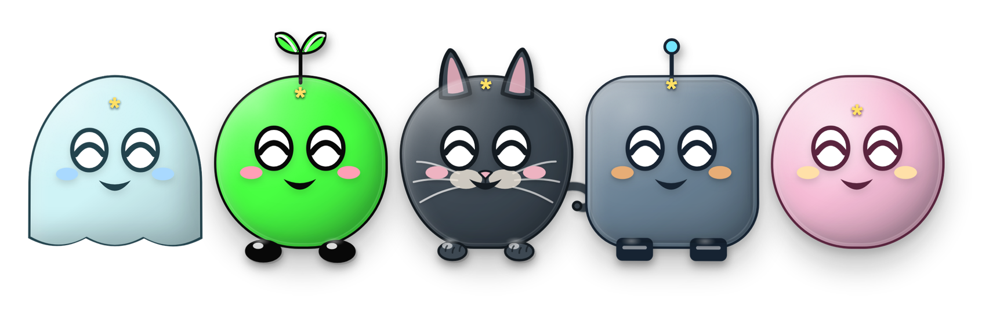

**English** | [简体中文](./README.zh-CN.md)

# Desktop Mascot

A lightweight interactive pet that lives in the corner of your desktop. Built with Tauri 2 + React + TypeScript and rendered by `lively-mascot`, it supports a transparent always-on-top window, mouse following, and real-time settings sync.



The built-in characters, rendered by `lively-mascot` at runtime.


## Documentation

- [Roadmap](./ROADMAP.md) — where the project is heading and what comes next
- [Changelog](./CHANGELOG.md) — notable changes in each release

## Features

- 5 characters: Ghost, Sprout, Cat, Robot, and Jelly
- 2D / 3D display modes, plus adjustable character size
- Mouse following, a character outline toggle, and custom body / outline / accent colors
- Multiple expression states, previewable in the dashboard before you apply them
- Click the character to trigger a happy expression; right-click to open the settings dashboard
- System tray menu: open the dashboard, hide / show the pet, quit the app
- Dashboard supports Chinese / English and light / dark themes
- Settings are stored locally and synced instantly between the pet window and the dashboard
- Import `model.js`, `model.css`, and `model.json` generated by the `lively-mascot` 0.3.1 image-model Skill
- User models are stored in the system app data directory rather than inside the installer or the front-end build output, so they survive app upgrades

## Requirements

- Node.js 18+
- Rust stable (Tauri 2)
- A macOS, Windows, or Linux desktop environment

Make sure the Tauri system dependencies are installed before you start — see [Tauri prerequisites](https://tauri.app/start/prerequisites/).

## Development

```bash
# Install front-end dependencies
yarn install

# Start the Vite dev server
yarn dev

# Start Tauri desktop dev mode
yarn tauri dev
```

You can open the Vite URL in a browser for a quick preview, but native capabilities such as window sizing, system mouse coordinates, the tray, and window positioning only work fully under `yarn tauri dev`.

## Build

```bash
# Type-check and build the front end
yarn build

# Build distributable desktop installers
yarn tauri build
```

Tauri writes build artifacts to `src-tauri/target/release/bundle/`.

Official release builds are published for macOS (Apple Silicon and Intel) and Windows only. Linux is supported by the toolchain and can be built from source with `yarn tauri build`, but no Linux package is published yet.

## Landing page

The landing page lives in [`landing/`](landing/) and is a static site with no build step. GitHub Actions publishes it automatically once it lands on `master`.

For the first deployment, set **Source** to **GitHub Actions** under **Settings → Pages → Build and deployment** in the repository. The page is then available at `https://jingluoguo.github.io/desktop-mascot/`.

## In-app updates

On startup, a release build first reads the version of the `desktop-mascot` entry in `AUTHOR_DATA_URL`. Only when the remote version is higher than the current one does it check the latest GitHub Release of `jingluoguo/desktop-mascot`. If a signed update package exists for the current platform, the app downloads it automatically, and the user confirms a restart to install it once the download completes.

Before the first release, configure the full contents of your local `src-tauri/.tauri/updater.key` as the repository secret `TAURI_SIGNING_PRIVATE_KEY`. That file is usually a single line of Base64 text — do not paste only the Base64-decoded content, the `updater.key.pub` public key, or a single line from it. If you set a password when generating the key, configure that same password as `TAURI_SIGNING_PRIVATE_KEY_PASSWORD`. The private key is excluded by `.gitignore` and must never be committed. The workflow validates the key format before building.

## Logo

The app logo source file is [`src-tauri/icons/desktop-mascot-logo.svg`](src-tauri/icons/desktop-mascot-logo.svg), and the web favicon is [`public/favicon.svg`](public/favicon.svg). Tauri's PNG, ICO, and ICNS icons are generated from that SVG into `src-tauri/icons/`.

## Project structure

```text
src/                 React UI and the pet / dashboard logic
src-tauri/src/       Tauri native window, tray, and commands
src-tauri/icons/     App icon assets
public/              Vite static assets
```

## Importing custom models

In the "Character models" area of the dashboard, you can drag a `.livelymodel` file into the import area or click to pick one. A `.livelymodel` is a ZIP-format model package that must contain `model.js`, `model.css`, and `model.json`; you can also select those three files together. The files should be generated by the image-model Skill shipped with `lively-mascot`, and the `id` in `model.json` must match the model definition.

User models can be exported as `.livelymodel`, overwritten on import, or deleted. Built-in models cannot be deleted or overwritten. The app copies user models into `models/` under the system app data directory, so installing a new version will not overwrite them.

A model package can also declare the interaction reactions it supports in `model.json`. Models that omit this field are compatible with every built-in expression; once declared, the pet only plays the listed expressions for the matching triggers and safely keeps its current state for other configurations.

```json
{
  "interactions": {
    "click": ["10", "16"],
    "doubleClick": ["16"],
    "hover": ["11"],
    "drag": ["38"]
  }
}
```

The available triggers are `click`, `doubleClick`, `hover`, and `drag`. Expression IDs correspond to the expression definitions in `lively-mascot`, and may also be custom expressions defined by the model package.

## License

Project code follows the [LICENSE](LICENSE) file in this repository. Character rendering is provided by [`lively-mascot`](https://github.com/jingluoguo/lively-mascot).
